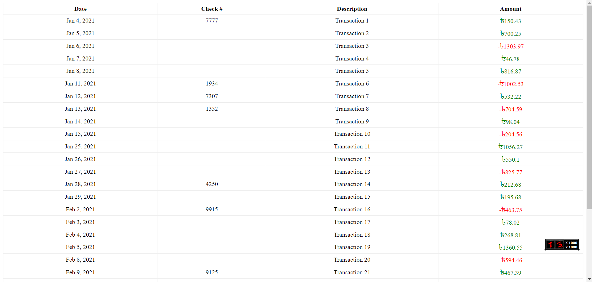

# simple-txn-calc

In this project, you are able to extract transaction information from CSV files using PHP. Additionally, upon retrieval of the transaction data, statistics such as overall income, total expenses, and net income will be displayed.

